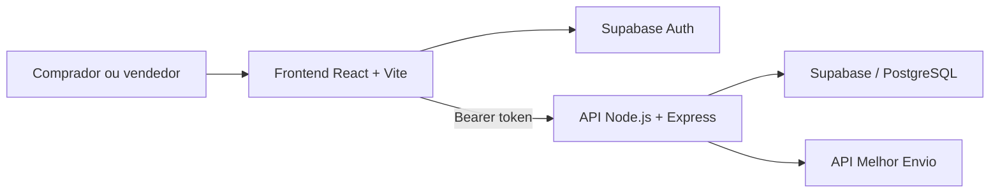

# BigPeças

> Marketplace de peças automotivas que conecta compradores e vendedores em uma jornada completa: catálogo, carrinho, frete, pedido, acompanhamento da entrega e avaliações de compra verificada.


## Sobre o projeto

O **BigPeças** é uma aplicação web full stack voltada à compra e venda de peças automotivas. A plataforma reúne autenticação, catálogo, gestão de estoque, favoritos, carrinho, cotação de frete, checkout, histórico de compras e vendas, mensagens e avaliações verificadas.

Há duas jornadas principais:

- **Comprador:** pesquisa peças, consulta vendedores, calcula o frete, conclui a compra, acompanha o pedido, confirma o recebimento e avalia os produtos e o vendedor.
- **Vendedor:** mantém o perfil da loja, cadastra e edita peças, acompanha vendas, informa o envio e recebe avaliações verificadas.

## Funcionalidades

- Cadastro, login, confirmação de e-mail e recuperação de senha com Supabase Auth.
- Catálogo de peças com categorias, materiais, compatibilidade e informações do fornecedor.
- Cadastro, edição e remoção de peças pelo vendedor.
- Perfil público da loja e recomendações de vendedores e produtos.
- Lista de desejos e carrinho de compras.
- Cálculo de frete pela API do Melhor Envio.
- Checkout com endereço, forma de pagamento, revisão e confirmação da compra.
- Histórico separado de compras e vendas.
- Acompanhamento dos estados do pedido e código de rastreio.
- Confirmação de recebimento feita exclusivamente pelo comprador.
- Avaliação do vendedor e de cada produto somente depois da entrega.
- Selo de **compra verificada** nas avaliações.
- Conversas entre usuários.
- API protegida por autenticação, rate limiting, Helmet e tratamento centralizado de erros.

### Fluxo do pedido

```text
Aguardando pagamento → Pago → Enviado → Entregue → Avaliações liberadas
          └──────────────────→ Cancelado
```

No protótipo atual, a confirmação do pagamento acontece manualmente na etapa final do checkout. Em produção, a transição para `pago` deve ser feita por um webhook de um provedor de pagamentos.

## Arquitetura



| Camada | Tecnologias |
| --- | --- |
| Frontend | React 18, React Router 6, Vite 5, Supabase JS |
| Backend | Node.js, Express, Helmet, Express Rate Limit, Winston |
| Dados e autenticação | Supabase, PostgreSQL, Supabase Auth |
| Frete | Melhor Envio |
| Infraestrutura | Docker, Docker Compose, Nginx |

## Estrutura do repositório

```text
BigPecas/
├── backend/
│   ├── src/
│   │   ├── config/          # Cliente Supabase
│   │   ├── middlewares/     # Autenticação e erros
│   │   ├── routes/          # Endpoints da API
│   │   ├── services/        # Regras de negócio
│   │   └── utils/           # Logs e utilitários
│   ├── supabase/
│   │   └── migrations/      # Evoluções do banco de dados
│   ├── .env.example
│   └── package.json
├── frontend/
│   └── telaAuthSupabase/
│       ├── public/
│       ├── src/
│       │   ├── components/
│       │   ├── contexts/
│       │   ├── pages/
│       │   └── services/
│       ├── .env.example
│       └── package.json
├── docker-compose.yml
└── README.md
```

## Pré-requisitos

- [Node.js](https://nodejs.org/) 18 ou superior.
- npm.
- Um projeto no [Supabase](https://supabase.com/).
- Uma conta e credenciais do [Melhor Envio](https://melhorenvio.com.br/), caso queira testar o cálculo de frete.
- Docker e Docker Compose, apenas se optar pela execução em contêineres.

## Instalação local

### 1. Clone o repositório

```bash
git clone git@github.com:Danilogggs/BigPecas.git
cd BigPecas
```

### 2. Configure o Supabase

Crie ou conecte um projeto Supabase com o schema base do BigPeças. As tabelas de usuários, peças, catálogos, pedidos, vendas e favoritos devem existir antes de executar as migrations complementares.

No **SQL Editor** do Supabase, execute as migrations em `backend/supabase/migrations/`. A migration atual adiciona os vínculos entre pedidos e vendas e cria a estrutura de avaliações de produtos pós-compra:

```text
backend/supabase/migrations/20260813_avaliacoes_pos_compra.sql
backend/supabase/migrations/20260820_administradores.sql
backend/supabase/migrations/20260820_admin_dashboard_preferences.sql
```

### 3. Configure o backend

Crie o arquivo de ambiente a partir do modelo:

```bash
cd backend
cp .env.example .env
npm install
```

No PowerShell, use `Copy-Item .env.example .env` no lugar de `cp`.

Preencha `backend/.env` com as credenciais do seu ambiente. Para desenvolvimento, a URL do Melhor Envio deve apontar para o sandbox:

```env
MELHOR_ENVIO_URL=https://sandbox.melhorenvio.com.br
```

Para produção, use `https://melhorenvio.com.br` e um token emitido no mesmo ambiente.

Inicie a API:

```bash
npm run dev
```

A API ficará disponível em `http://localhost:3001`.

### 4. Configure o frontend

Em outro terminal:

```bash
cd frontend/telaAuthSupabase
cp .env.example .env
npm install
npm run dev
```

No PowerShell, use `Copy-Item .env.example .env` no lugar de `cp`.

O frontend ficará disponível em `http://localhost:5173`.

## Variáveis de ambiente

### Backend

As variáveis completas estão documentadas em [`backend/.env.example`](backend/.env.example).

| Variável | Finalidade |
| --- | --- |
| `PORT` | Porta da API Express. |
| `FRONTEND_URL` | Origem permitida pelo CORS. |
| `SUPABASE_URL` | URL do projeto Supabase. |
| `SUPABASE_ANON_KEY` | Chave pública utilizada em operações de autenticação. |
| `SUPABASE_SERVICE_ROLE_KEY` | Chave administrativa usada somente pelo backend. |
| `SUPABASE_EMAIL_CONFIRM_REDIRECT_TO` | Retorno após a confirmação de e-mail. |
| `MELHOR_ENVIO_URL` | URL do sandbox ou da produção do Melhor Envio. |
| `MELHOR_ENVIO_ACCESS_TOKEN` | Token de acesso à API de frete. |
| `MELHOR_ENVIO_REFRESH_TOKEN` | Token utilizado na renovação automática. |

### Frontend

```env
VITE_SUPABASE_URL=https://SEU_PROJETO.supabase.co
VITE_SUPABASE_ANON_KEY=SUA_CHAVE_ANONIMA
VITE_API_URL=http://localhost:3001
```

## Rotas principais da API

| Prefixo | Responsabilidade |
| --- | --- |
| `/api/auth` | Cadastro, sessão e perfil do usuário. |
| `/api/pecas` | Catálogo, cadastro, edição e recomendações. |
| `/api/pedidos` | Checkout, histórico e atualização de status. |
| `/api/avaliacoes` | Avaliações verificadas de vendedores e produtos. |
| `/api/admin` | Administração de usuários, peças, pedidos e avaliações. Consulte `backend/ADMIN_API.md`. |
| `/api/frete` | Cotação e renovação do token do Melhor Envio. |
| `/api/wish` | Lista de desejos. |
| `/api/categorias` | Catálogo de categorias. |
| `/api/materiais` | Catálogo de materiais. |
| `/api/health` | Verificação de disponibilidade da API. |

Com exceção dos endpoints públicos de autenticação e saúde, as rotas esperam um token Supabase:

```http
Authorization: Bearer <access_token>
```

A documentação detalhada do catálogo de peças está em [`backend/API_DOCUMENTATION.md`](backend/API_DOCUMENTATION.md).

## Docker

Com `backend/.env` configurado na máquina:

```bash
docker compose up --build
```

Serviços disponíveis:

- Frontend: `http://localhost`
- Backend: `http://localhost:3001`
- Health check: `http://localhost:3001/api/health`

## Verificação do projeto

Compile o frontend antes de abrir um Pull Request:

```bash
cd frontend/telaAuthSupabase
npm run build
```

Teste também a disponibilidade do backend:

```bash
curl http://localhost:3001/api/health
```

O projeto ainda não possui uma suíte automatizada de testes. Adicionar testes unitários, de integração e de interface está entre as melhorias recomendadas.

## Segurança

- Nunca faça commit de arquivos `.env`.
- Nunca exponha `SUPABASE_SERVICE_ROLE_KEY` ou tokens do Melhor Envio no frontend.
- Use tokens separados para sandbox e produção.
- Revogue imediatamente qualquer chave publicada em commits, issues, prints ou conversas.
- Em produção, confirme pagamentos por webhook e valide a assinatura enviada pelo provedor.

## Como contribuir

1. Crie uma branch a partir de `main`:

   ```bash
   git checkout -b feat/minha-melhoria
   ```

2. Faça alterações pequenas e objetivas.
3. Valide o build do frontend e o funcionamento da API.
4. Crie um commit descritivo:

   ```bash
   git commit -m "feat: descreve a melhoria"
   ```

5. Envie a branch e abra um Pull Request.

## Próximos passos

- Integrar um gateway de pagamentos com confirmação por webhook.
- Automatizar o acompanhamento de entregas.
- Consolidar todo o schema base do Supabase em migrations versionadas.
- Adicionar testes automatizados e integração contínua.
- Implementar observabilidade e monitoramento para produção.

---

Desenvolvido para tornar a busca e a comercialização de peças automotivas mais simples, segura e transparente.
