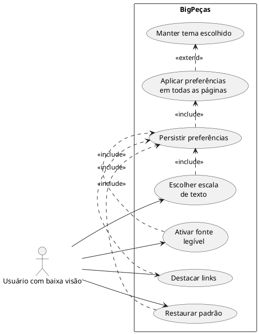
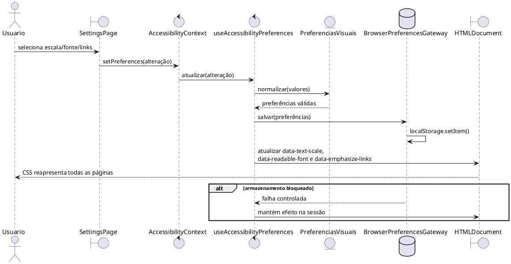
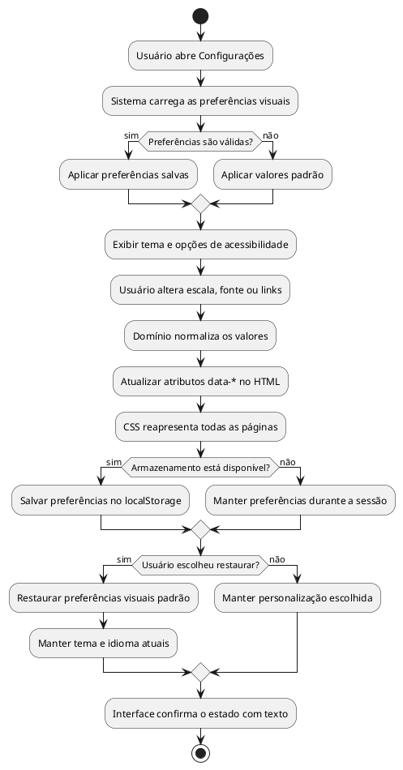

# Acessibilidade visual do BigPeças — engenharia de software e especificação

## Resumo executivo

Este trabalho desenvolve acessibilidade visual no BigPeças para pessoas com baixa visão, especialmente usuários mais velhos com dificuldade para ler textos pequenos, perceber contrastes ou distinguir elementos apenas pela cor.

Antes da implementação, o problema foi analisado por meio de estudo do público, design thinking, persona, jornada do usuário, requisitos funcionais e não funcionais, casos de uso UML, diagrama de sequência, cenários BDD e matriz de rastreabilidade.

A solução implementada permite escolher o tamanho dos textos, ativar uma fonte de alta legibilidade e sublinhar links. Também melhora contraste, foco de teclado, responsividade, independência de cores e redução de movimentos. As preferências ficam salvas no navegador e são aplicadas em todas as páginas sem alterar o tema ou o idioma escolhido.

A implementação foi organizada em camadas de domínio, aplicação, infraestrutura e apresentação. Ao final, os testes automatizados, o build de produção, as medições de contraste e a validação em tela de celular confirmaram o funcionamento da solução.

## 1. Objetivo e ordem de execução

Este documento foi elaborado antes da implementação e é a fonte de verdade da funcionalidade de acessibilidade visual. Ele reúne, em um único artefato, o estudo do público, design thinking, persona, jornada, requisitos, casos de uso, diagramas, BDD, critérios de aceitação, riscos e rastreabilidade.

Ordem adotada:

1. estudar o público e suas barreiras;
2. transformar as barreiras em requisitos verificáveis;
3. modelar casos de uso e o fluxo técnico;
4. definir cenários BDD e critérios de aceite;
5. implementar somente o que foi especificado;
6. testar e preencher as evidências da matriz de rastreabilidade.

## 2. Público escolhido e estudo de acessibilidade

### 2.1 Público principal

Pessoas com baixa visão, com atenção especial a usuários mais velhos que apresentam redução de acuidade visual, sensibilidade a contraste ou percepção de cores. O escopo não pressupõe cegueira total nem substitui uma futura etapa específica para leitores de tela.

### 2.2 Contexto no BigPeças

O BigPeças exige leitura e comparação frequentes de nomes, códigos SKU/OEM, preços, estoque, estados do pedido, formulários e ações de compra. Texto pequeno, contraste insuficiente, foco discreto ou ações identificadas apenas por cor aumentam o risco de erro e abandono.

### 2.3 Evidências utilizadas

- A W3C informa que o envelhecimento pode reduzir sensibilidade a contraste, percepção de cores e capacidade de foco próximo, afetando a leitura de páginas: <https://www.w3.org/WAI/older-users/>.
- A WCAG 2.2 estabelece contraste mínimo de 4,5:1 para texto comum e 3:1 para texto grande: <https://www.w3.org/WAI/WCAG22/Understanding/contrast-minimum>.
- A WCAG orienta que texto possa chegar a 200% sem perda de conteúdo ou funcionalidade: <https://www.w3.org/WAI/WCAG22/Understanding/resize-text>.
- Cor não deve ser o único meio de transmitir estado ou ação: <https://www.w3.org/WAI/WCAG22/Understanding/use-of-color>.
- Componentes operáveis por teclado devem possuir indicador de foco visível: <https://www.w3.org/WAI/WCAG22/Understanding/focus-visible>.

### 2.4 Barreiras identificadas

| Código | Barreira | Consequência no marketplace |
|---|---|---|
| B01 | Texto pequeno ou fixado em pixels | Dificulta ler dados técnicos e preencher formulários |
| B02 | Contraste baixo em texto, borda ou placeholder | Informações parecem ausentes nos temas claro e escuro |
| B03 | Estado indicado somente por cor | Status, erro ou ação pode não ser compreendido |
| B04 | Foco de teclado discreto | O usuário perde a posição durante a navegação |
| B05 | Links visualmente semelhantes a texto comum | Ações disponíveis deixam de ser percebidas |
| B06 | Preferência visual não persistida | O usuário precisa reconfigurar o site a cada visita |
| B07 | Movimento não essencial | Pode dificultar leitura e concentração |

## 3. Design thinking

### Empatizar

Foram consideradas tarefas centrais de um comprador com baixa visão: pesquisar uma peça, comparar dados, abrir detalhes, adicionar ao carrinho, concluir o checkout e acompanhar o pedido.

### Definir

Problema: “Como permitir que uma pessoa com baixa visão leia e reconheça ações e estados do BigPeças sem perder conteúdo, alterar seu fluxo de compra ou refazer preferências a cada acesso?”

### Idear

Soluções selecionadas:

- três escalas de texto;
- modo de leitura com tipografia sem serifa e espaçamento ampliado;
- opção para sublinhar links;
- foco global espesso e de duas cores;
- contraste mínimo nos dois temas existentes;
- redundância textual/visual para estados;
- redução de movimento conforme preferência do sistema;
- persistência local das escolhas.

Não foi selecionado um terceiro tema de “alto contraste”, pois o requisito do produto é manter apenas claro e escuro. Os dois devem ser legíveis por padrão.

### Prototipar

O protótipo funcional será incorporado à página Configurações usando os mesmos cartões e controles de tema já existentes.

### Testar

Serão usados testes unitários do domínio e do contexto, regressão automatizada, build de produção e roteiro manual a 200% de zoom.

## 4. Persona

**Nome:** Carlos Mendes  
**Idade:** 64 anos  
**Contexto:** restaura veículos antigos e compra peças pelo notebook e pelo celular.  
**Condição:** baixa visão moderada, menor sensibilidade a contraste e dificuldade com textos pequenos.  
**Objetivo:** localizar uma peça pelo código OEM, verificar estoque e concluir a compra sem ajuda.  
**Frustrações:** descrições apagadas, botões sem identificação evidente, foco invisível e necessidade de ampliar cada página novamente.  
**Necessidades:** texto ampliado, interface previsível, links reconhecíveis, contraste consistente e preferências persistentes.

## 5. Jornada do usuário

| Etapa | Ação | Barreira possível | Requisito associado | Resultado esperado |
|---|---|---|---|---|
| Configuração | Escolhe escala e legibilidade | Controles pouco claros | RF-AV-01, RF-AV-02 | Preferência aplicada e salva |
| Catálogo | Pesquisa e compara peças | Nome, preço ou SKU pequenos | RNF-AV-01, RNF-AV-03 | Conteúdo legível e sem corte |
| Detalhes | Confere estoque e condição | Estado reconhecido só pela cor | RNF-AV-04 | Estado também possui texto/ícone |
| Carrinho | Ajusta quantidade | Foco pouco visível | RNF-AV-02 | Controle focado é evidente |
| Checkout | Preenche dados | Labels e placeholders apagados | RNF-AV-01 | Campos permanecem legíveis |
| Pedidos | Acompanha andamento | Cores de status confundem | RNF-AV-04 | Nome e ícone acompanham a cor |

## 6. Requisitos funcionais

### RF-AV-01 — Escala de texto

O usuário deve poder selecionar `Padrão (100%)`, `Grande (112,5%)` ou `Extra grande (125%)` na página Configurações.

### RF-AV-02 — Persistência

Escala, fonte legível e destaque de links devem ser armazenados no navegador e restaurados antes da interação seguinte.

### RF-AV-03 — Fonte de alta legibilidade

O usuário deve poder substituir títulos serifados por fonte sem serifa e ampliar o espaçamento de leitura sem alterar o conteúdo.

### RF-AV-04 — Destaque de links

O usuário deve poder ativar sublinhado persistente nos links textuais para distingui-los sem depender somente da cor.

### RF-AV-05 — Restauração

O usuário deve poder restaurar as preferências visuais padrão sem alterar o tema claro/escuro escolhido.

## 7. Requisitos não funcionais e critérios de aceite

| Código | Requisito | Critério de aceite |
|---|---|---|
| RNF-AV-01 | Contraste | Texto comum deve buscar 4,5:1 e texto grande 3:1 em ambos os temas |
| RNF-AV-02 | Foco visível | Todo componente focável deve exibir contorno sólido, persistente e perceptível |
| RNF-AV-03 | Redimensionamento | A página deve continuar utilizável com zoom do navegador em 200%, sem perda de ação ou conteúdo |
| RNF-AV-04 | Independência de cor | Estado, erro e seleção devem possuir texto, ícone, borda ou forma além da cor |
| RNF-AV-05 | Responsividade | Preferências devem funcionar em desktop e celular sem gerar rolagem horizontal global |
| RNF-AV-06 | Movimento | Animações não essenciais devem ser reduzidas quando `prefers-reduced-motion` estiver ativo |
| RNF-AV-07 | Arquitetura | Regras de preferência não podem depender de React, CSS ou `localStorage`; infraestrutura deve ser substituível |

## 8. Regras de negócio

- RB-AV-01: valores desconhecidos armazenados devem voltar ao padrão seguro.
- RB-AV-02: falha ou bloqueio do `localStorage` não pode impedir o uso da página.
- RB-AV-03: alterar acessibilidade não altera o idioma nem o tema selecionado.
- RB-AV-04: as preferências são aplicadas por atributos `data-*` no elemento `html`.
- RB-AV-05: a escala interna complementa, mas não bloqueia, o zoom nativo do navegador.
- RB-AV-06: apenas as opções definidas no domínio podem ser persistidas.

## 9. Casos de uso

### UC-AV-01 — Personalizar acessibilidade visual

**Ator:** usuário autenticado com baixa visão.  
**Pré-condição:** usuário abriu Configurações.  
**Fluxo principal:** seleciona a escala; ativa fonte legível e/ou destaque de links; a interface atualiza imediatamente; o sistema persiste a escolha.  
**Fluxo alternativo:** se o armazenamento estiver indisponível, a escolha funciona durante a sessão atual.  
**Pós-condição:** todas as páginas passam a usar os atributos visuais escolhidos.

### UC-AV-02 — Restaurar preferências

**Ator:** usuário autenticado.  
**Pré-condição:** existe pelo menos uma preferência diferente do padrão.  
**Fluxo:** aciona “Restaurar padrão”; o sistema retorna escala, fonte e links aos valores padrão e atualiza o armazenamento.  
**Pós-condição:** tema e idioma permanecem inalterados.

### UC-AV-03 — Retomar preferências salvas

**Ator:** usuário recorrente.  
**Pré-condição:** há preferências válidas no navegador.  
**Fluxo:** abre o BigPeças; o provider lê, normaliza e aplica os valores ao `html`.  
**Exceção:** dados inválidos são descartados logicamente e substituídos pelo padrão.

## 10. Diagrama UML de casos de uso


[Abrir PNG](diagrams/casos-de-uso-acessibilidade.png) · [Fonte PlantUML](diagrams/casos-de-uso-acessibilidade.puml)



## 11. Diagrama de sequência


[Abrir PNG](diagrams/sequencia-preferencias-acessibilidade.png) · [Fonte PlantUML](diagrams/sequencia-preferencias-acessibilidade.puml)



## 12. Diagrama de atividades

O diagrama apresenta o fluxo completo desde a entrada em Configurações até a aplicação e persistência das preferências, incluindo valores inválidos, armazenamento bloqueado e restauração do padrão.


[Abrir PNG](diagrams/atividade-configuracao-acessibilidade.png) · [Fonte PlantUML](diagrams/atividade-configuracao-acessibilidade.puml)



## 13. Cenários BDD

```gherkin
Funcionalidade: Preferências de acessibilidade visual
  Como pessoa com baixa visão
  Quero adaptar a apresentação do BigPeças
  Para ler e reconhecer ações com autonomia

  Cenário: Aumentar o tamanho dos textos
    Dado que estou na página de configurações
    Quando seleciono a escala "Extra grande"
    Então o elemento raiz deve receber a escala "extra-large"
    E a escolha deve ser armazenada no navegador

  Cenário: Restaurar a escala salva
    Dado que salvei a escala "Grande"
    Quando abro novamente o BigPeças
    Então a escala "Grande" deve ser aplicada automaticamente

  Cenário: Ativar fonte de alta legibilidade
    Dado que títulos serifados dificultam minha leitura
    Quando ativo "Fonte de alta legibilidade"
    Então títulos e textos devem usar a família sem serifa
    E o espaçamento de leitura deve aumentar

  Cenário: Destacar links sem depender de cor
    Dado que não diferencio links apenas pela cor
    Quando ativo "Sublinhar links"
    Então links textuais devem ficar sublinhados

  Cenário: Restaurar o padrão sem alterar o tema
    Dado que uso o tema escuro e preferências visuais personalizadas
    Quando aciono "Restaurar padrão"
    Então escala, fonte e links devem voltar ao padrão
    E o tema deve continuar escuro

  Cenário: Armazenamento indisponível
    Dado que o navegador bloqueou o armazenamento local
    Quando altero uma preferência visual
    Então a alteração deve funcionar durante a sessão
    E a página não deve apresentar erro ao usuário

  Cenário: Navegar por teclado
    Dado que uso a tecla Tab
    Quando um controle recebe foco
    Então deve existir um contorno visível ao redor do controle

  Cenário: Reduzir movimento
    Dado que configurei redução de movimento no sistema
    Quando acesso uma página com animações não essenciais
    Então transições e animações devem ser removidas ou reduzidas
```

## 14. Arquitetura prevista

```text
frontend/src/features/acessibilidade/
├── domain/
│   └── preferenciasVisuais.js
├── application/
│   └── useAccessibilityPreferences.js
└── infrastructure/
    └── browserAccessibilityPreferencesGateway.js

frontend/src/contexts/AccessibilityContext.jsx
frontend/src/pages/SettingsPage.jsx
frontend/src/styles/design-system.css
```

- **Domain:** valores permitidos, padrões e normalização; sem framework.
- **Application:** estado e orquestração das preferências.
- **Infrastructure:** leitura e escrita no navegador.
- **Context/Presentation:** disponibilização global e controles da página.
- **CSS:** interpretação exclusiva dos atributos `data-*`.

## 15. Matriz de rastreabilidade

| Requisito | Caso de uso/BDD | Implementação realizada | Evidência de teste | Situação |
|---|---|---|---|---|
| RF-AV-01 | UC-AV-01 / Aumentar textos | domínio, contexto, SettingsPage e CSS | domínio, contexto e SettingsPage | Concluído |
| RF-AV-02 | UC-AV-01 e 03 / Restaurar escala | gateway tolerante a falhas e hook | gateway e contexto | Concluído |
| RF-AV-03 | UC-AV-01 / Fonte legível | atributo global, tokens e controle | SettingsPage/contexto | Concluído |
| RF-AV-04 | UC-AV-01 / Destacar links | atributo global e sublinhado CSS | SettingsPage/contexto | Concluído |
| RF-AV-05 | UC-AV-02 / Restaurar padrão | contexto e SettingsPage | restauração preservando tema | Concluído |
| RNF-AV-01 | Jornada completa | tokens corrigidos nos dois temas | medição de contraste + build | Concluído |
| RNF-AV-02 | Navegar por teclado | foco global de duas cores | inspeção CSS e suporte no navegador | Concluído |
| RNF-AV-03 | Jornada completa | unidades relativas e reflow | viewport móvel sem overflow; roteiro 200% disponível | Implementado |
| RNF-AV-04 | Catálogo, formulários e pedidos | texto/ícone/borda além de cor | controles e estados revisados | Concluído |
| RNF-AV-05 | Jornada completa | grids fluidos e media queries | navegador em 375 × 812 sem overflow | Concluído |
| RNF-AV-06 | Reduzir movimento | `prefers-reduced-motion` global | inspeção CSS e suporte no navegador | Concluído |
| RNF-AV-07 | Todos | feature em camadas | testes do domínio e gateway | Concluído |

## 16. Riscos e decisões

| Risco | Mitigação |
|---|---|
| Escala causar corte em componentes antigos | limitar controle interno a 125% e validar também zoom nativo a 200% |
| `localStorage` indisponível | gateway tolerante a falhas e estado em memória |
| Preferência inválida após atualização | normalização central no domínio |
| Contraste corrigido em uma página e quebrado em outra | usar tokens globais, não cores locais novas |
| Alto contraste divergir do requisito anterior | não criar novo tema; corrigir claro e escuro existentes |
| Implementação misturar regra com React/CSS | manter domínio, aplicação e infraestrutura separados |

## 17. Roteiro de validação manual

1. Abrir Configurações e alternar as três escalas.
2. Recarregar a página e confirmar persistência.
3. Ativar fonte legível e sublinhado de links.
4. Alternar entre claro e escuro e confirmar que as preferências permanecem.
5. Restaurar o padrão e confirmar que o tema não muda.
6. Usar `Tab` nas páginas inicial, catálogo, detalhe, carrinho e checkout.
7. Aplicar zoom do navegador em 200% nas larguras 1280 px e 375 px.
8. Confirmar ausência de corte, sobreposição e rolagem horizontal global.
9. Ativar redução de movimento no sistema e confirmar a remoção de animações não essenciais.

## 18. Definição de pronto

A funcionalidade está concluída quando todos os requisitos funcionais estiverem implementados, os testes de domínio/contexto e a regressão estiverem verdes, o build de produção for aprovado e a matriz de rastreabilidade registrar as evidências produzidas.

## 19. Evidências da implementação

Implementação concluída em 26/08/2026, depois da definição dos artefatos anteriores.

- 27 suítes e 433 testes do frontend aprovados;
- 21 testes novos cobrindo domínio, gateway, contexto e página de configurações;
- build Vite de produção aprovado com 162 módulos transformados;
- validação local em viewport de 375 × 812 sem rolagem horizontal global;
- todas as declarações tipográficas fixas restantes foram convertidas de `px` para `rem`;
- preferências inválidas e falhas do armazenamento retornam ao padrão seguro;
- tema e idioma permanecem independentes das preferências visuais.

### Medições dos principais tokens

| Combinação | Razão medida |
|---|---:|
| Texto principal claro / fundo creme | 12,11:1 |
| Texto secundário claro / fundo creme | 5,11:1 |
| Ouro acessível claro / superfície branca | 5,67:1 |
| Borda de controle clara / superfície branca | 3,70:1 |
| Foco claro / superfície branca | 6,70:1 |
| Texto principal escuro / fundo escuro | 15,98:1 |
| Texto secundário escuro / superfície escura | 8,06:1 |
| Ouro escuro / superfície escura | 8,30:1 |
| Borda de controle escura / superfície escura | 3,94:1 |
| Foco escuro / fundo escuro | 11,89:1 |

Os valores de texto superam 4,5:1 e os indicadores não textuais medidos superam 3:1 nas combinações principais.
